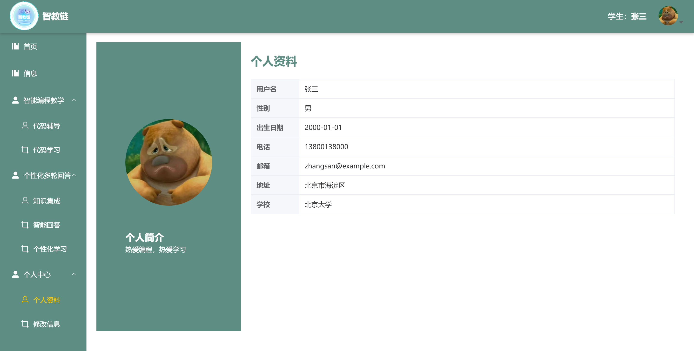

# 智教链

该项目是学生学习数据结构和算法的软件。主色调：#5e8d83

### 功能

#### 智能编程教学

1. 代码辅导
2. 代码学习

#### 个性化多轮回答

1. 知识集成
2. 智能回答
3. 个性化学习

#### 后台管理

1. 管理学生信息，通知等。

#### 个人信息

1. 个人资料
2. 修改信息

## 项目展示

#### 学生端

###### 首页

###### 信息页

###### 代码辅导页

###### 代码学习页

###### 知识集成页

###### 智能回答页

###### 个性化学习

###### 个人信息页

#### 管理员端

###### 首页

###### 学生管理

###### 通知管理

###### 编辑信息

#### 预览

###### 首页

###### 登录注册

